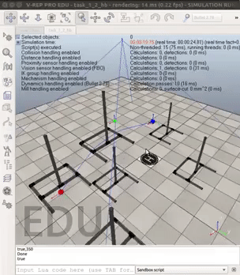

# UAVs for Disaster Management

### Aim
UAV for disaster management is a project planned under IoT society of DSC IIT Patna in which we are planning to make a autopilot drone that would move in a disaster affected area and will figure out the group of people requiring help. This drone will then send GPS coordinates to rescue team making their task of locating people easy,

### Impact
This project is aimed to solve the real world problem of saving human lives in natural disasters. We intend to use drones powered with Artificial Intelligence and Computer Vision.
We want to developed solutions to improve the current disaster response systems by creating an end-to-end system for providing accurate and critical information as swiftly as possible to the relief task forces making there work more efficient and saving many lives.

<table>
  <tr><td width="50%" style="text-align:center"></td><td width="50%" style="text-align:center"></td></tr>
  <tr><td style="text-align:center"><b>Drone platform</b></td><td style="text-align:center"><b>Path Planning Simulation in V-REP</b></td></tr>
</table> 

## Demo 

### Loiter aka GPS Lock Mode
*Click to see video*

### Tracing the Flight plane autonomously
*Click to see video*

### Dependencies
- OpenPose v1.4.0
- APM Mission Planner v2.0

### TODO
- [x] Make/Find a Drone with required features
- [x] Make the drone stable using GPS Lock
- [x] Fly the drone on a flight plan autonomously
- [ ] Get continuous video feed from the camera on drone onto a remote computer using Wi-Fi
- [x] Apply Pose Estimation and get key points of everybody in the frame

### Contributers
- [Abhipray Singh](https://github.com/AbhiprayIITP)
- [Piyush Chauhan](https://github.com/piyushchauhan)
- [Arya Das](https://github.com/aryadas98)
- [Vatsal Singhal](https://github.com/VatsalSin/)
- [Ananya Varshney](https://github.com/ananya-v/)

### License
This repository is under [MIT License](LICENSE)
