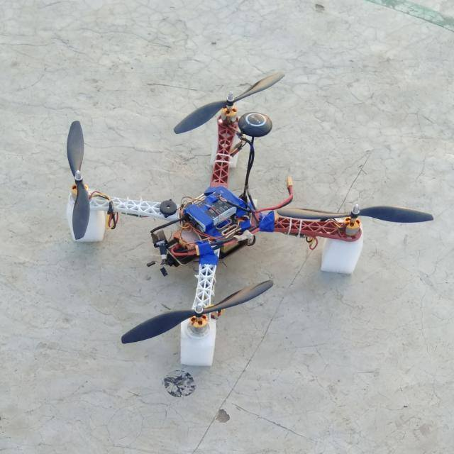

# UAVs for Disaster Management

### Overview
Ever thought that we can deploy drones to find humans who are in need of help during a disaster? We are here with a solution which can assist rescue operations to find needy people faster with our drones that can scan the disaster affected areas and send useful information like GPS coordinates where help is required and images of the people who need it, all of it in real time.   

### Aim
UAV for disaster management is a project planned under IoT society of DSC IIT Patna in which we are planning to make a autopilot drone that would move in a disaster affected area and will figure out the group of people requiring help. This drone will then send GPS coordinates to rescue team making their task of locating people easy,

### Impact
This project is aimed to solve the real world problem of saving human lives in natural disasters. We intend to use drones powered with Artificial Intelligence and Computer Vision.
We want to developed solutions to improve the current disaster response systems by creating an end-to-end system for providing accurate and critical information as swiftly as possible to the relief task forces making there work more efficient and saving many lives.

## Demo 

### Video feed from the Drone
*Click image to see video*

### Loiter aka GPS Lock Mode
*Click image to see video*

### Tracing the Flight plane autonomously
*Click image to see video*

### SPECIFICATIONS
The following components are used on the Drone:
1. **Pixhawk 4** : Firmware of the drone runs on PixHawk and it controls the speed of motors through Electronics Speed Controllers(ESCs) by taking the signal from Remote Controller.
2. **Raspberry Pi 3** : It connects to a base station and then transmits the video feed from the camera and then Video is process on the base station. 
3. **USB Camera** : to get the video feed)
4. **PPM Encoder**: To make Radio Communication possible for controlling the drone manually.
5. **Electronic Speed Controllers(ESC)** : They are used to give controlled current supply to the motors of the drone.
6. **Motors and Propellers**: They control the thrust and throttle of the drone. 
7. **GPS Module**: It return the coordinates of the position of the Drone. It is a very integral part as it is used for stabilization of the drone in Loitre mode (aka GPS Lock mode). Pixhawk gives a green fast blinking lights when the GPS is connected to more than 12 different satellites and green slow blinking when it is getting connection from 6 different satellites.

### Dependencies
- OpenPose v1.4.0
- APM Mission Planner v2.0
- MAV Link

### Contributers
- [Abhipray Singh](https://github.com/AbhiprayIITP)
- [Piyush Chauhan](https://github.com/piyushchauhan)
- [Arya Das](https://github.com/aryadas98)
- [Vatsal Singhal](https://github.com/VatsalSin/)

### Credits
This project was inspired from [Ayush Maniar](https://www.linkedin.com/in/ACoAACX1TfkBDERpyu7ckPGSmQ8KjmQItRGShpA/) and his team at IIT Madras. Their work on UAVs for Disaster Management is been taken to Indian Army.

### License
This repository is under [MIT License](LICENSE)
